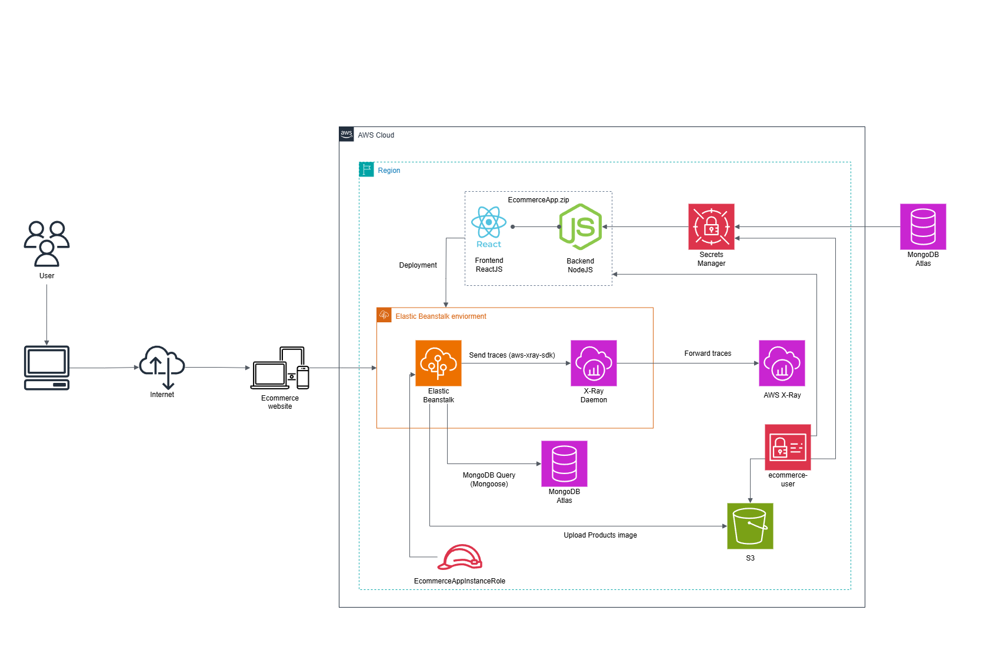

# Tracing và Debugging Node.js Applications với AWS X-Ray, CloudWatch, và MongoDB Atlas

### Tổng quan
Trong workshop thực hành này, bạn sẽ học cách xây dựng, triển khai, trace và monitor một ứng dụng web thương mại điện tử Node.js + React sử dụng các dịch vụ AWS. Chúng ta sẽ đi qua các kỹ thuật tracing nâng cao sử dụng AWS X-Ray và CloudWatch, quản lý credentials an toàn với Secrets Manager, và lưu trữ dữ liệu trên MongoDB Atlas. Bạn cũng sẽ tích hợp image uploads qua Amazon S3 và triển khai toàn bộ stack sử dụng Elastic Beanstalk.

 

### Nội dung
1. [Giới thiệu và Tổng quan Kiến trúc](1-introduce/)
2. [Chuẩn bị](2-preparation/)
3. [Instrument Node.js Backend với AWS X-Ray SDK](3-xray-sdk/)
4. [Triển khai: Backend & Frontend](4-deployment/)
5. [Bật S3 Upload và Image Hosting](5-s3-upload/)
6. [Trace Requests từ Frontend đến Database](6-end-to-end-tracing/)
7. [Đánh giá Workshop và Vấn đề thường gặp](7-review/)
8. [Dọn dẹp Tài nguyên AWS](8-cleanup/)
